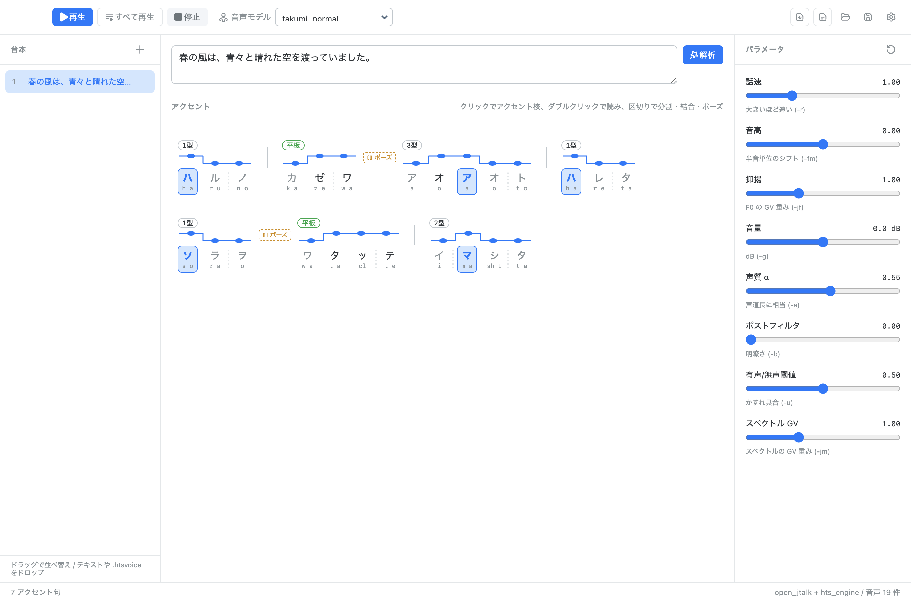

# JTalk GUI

Open JTalk と hts_engine を使った、アクセントを編集できる日本語音声合成 GUI（VOICEVOX ライク）。

テキストを解析してアクセント句に分け、アクセント核の位置・アクセント句の分割/結合・
ポーズの挿入をエディタ上で編集し、その結果を音声として再生・書き出しできます。



上の例では、Open JTalk が 2 型と判定した「ハレタ」を 1 型に変え、
句読点のない「ワタッテ」の前にポーズを追加しています。
この状態は `npm run demo:shot` で再現・再撮影できます。

## 仕組み

VOICEVOX のようなアクセント編集を Open JTalk で実現するために、
フルコンテキストラベルの生成処理を TypeScript に移植しています。

```
テキスト
  │  open_jtalk -ot        （形態素解析のみ利用）
  ▼
NJD 形態素列  ── ユーザーが pron / アクセント核 / chain_flag を編集
  │  src/main/engine/label.ts    （njd2jpcommon + jpcommon_label の移植）
  ▼
フルコンテキストラベル
  │  hts_engine -m voice.htsvoice
  ▼
WAV
```

open_jtalk が内部で行う「テキスト→ラベル」の後半部分を自前で持つことで、
アクセントを変えたラベルを組み立て直して hts_engine に直接渡せます。

ラベルの仕様は HTS Working Group の
*"An example of context-dependent label format for HMM-based speech synthesis in Japanese"*
(2015-12-25) に準拠しています。HTS のデモスクリプトに `lab_format.pdf` として
同梱されている文書です（再配布条件が明示されていないため、本リポジトリには含めていません）。

### 移植の正しさ

`test/validate-labels.ts` が 35 文について、移植版が生成したラベルと
open_jtalk 自身が出力したラベルを 1 行ずつ比較します。現在は全文完全一致です。

```
npm test
```

## 必要なもの

- Node.js 20 以上
- `open_jtalk` と `hts_engine`、辞書、`.htsvoice`

macOS / Windows / Linux で動きます。

```
# macOS — open-jtalk includes hts_engine, the dictionary and the voices
brew install open-jtalk

# Debian / Ubuntu — hts_engine and the dictionary are separate packages
sudo apt install open-jtalk open-jtalk-mecab-naist-jdic htsengine \
                 hts-voice-nitech-jp-atr503-m001
```

Windows は配布アーカイブを展開して `open_jtalk.exe` を PATH に通すか、
`C:\open_jtalk\bin` などに置いてください。

パスは PATH と各プラットフォームの標準的な配置場所から自動検出します
（Homebrew の Cellar、Debian の `/var/lib/mecab/dic/open-jtalk`、
配布 tarball のバージョン付き辞書ディレクトリなどに対応）。
見つからない場合はアプリの「設定」から個別に指定できます。
`.htsvoice` を置いたディレクトリを追加すると、その中のモデルも選択肢に出ます。

## 使い方

```
npm install
npm start
```

### アクセント編集

| 操作 | 効果 |
| --- | --- |
| モーラをクリック | そのモーラをアクセント核にする（もう一度で平板に戻す） |
| モーラをダブルクリック | その形態素の読みをその場で編集 |
| モーラ間の区切りをクリック | そこでアクセント句を分割 |
| 境界にホバー →「結合」 | 前のアクセント句と結合 |
| 境界にホバー →「ポーズ」 | ポーズの挿入 / 削除 |

アクセント句の破線は形態素の境界で、分割の目安になります。
分割は形態素の途中でも可能で、その場合は形態素自体を 2 つに分けます。
ただし長音「ー」は直前の音素を引き継ぐため、その直前では分割できません。

ポーズの挿入・削除はアクセント句の境界に紐づいているので、
削除したポーズは同じ場所からいつでも戻せます。

### ショートカット

| キー | 効果 |
| --- | --- |
| ⌘Z / ⇧⌘Z | 取り消す / やり直す |
| Enter | テキストを解析（Shift+Enter で改行） |
| ⌘R | 解析 |
| ⌘⏎ / Space | 再生 / 停止 |
| ⇧⌘⏎ | すべての行を連続再生 |
| ⌘N / ⌘D | 行を追加 / 複製 |
| ⌘⌫ (Win/Linux は Ctrl+Del) | 行を削除 |
| ⌘⌥↑ / ⌘⌥↓ | 行を上下に移動 |
| ↑ / ↓ | 行の選択を移動 |
| ⌘S / ⇧⌘S / ⌘O | 保存 / 別名で保存 / 開く |
| ⌘E / ⇧⌘E | WAV 書き出し / 全行を WAV 書き出し |

Windows と Linux では ⌘ を Ctrl に読み替えてください。

### 取り消し（Undo / Redo）

アクセント核・分割・結合・ポーズ・読み・パラメータ・行の追加削除並べ替えなど、
編集操作はすべて履歴に入ります（最大 200 段）。
文字入力とスライダー操作はひとまとまりに畳まれるので、
1 文字ずつ・1 ピクセルずつ戻ることはありません。

### ドラッグ & ドロップ

| ドラッグするもの | 効果 |
| --- | --- |
| 台本の行 | 並べ替え |
| `.txt` | 1 行 1 セリフとして読み込み |
| `.json` | 台本ファイルを開く |
| `.htsvoice` | 音声モデルとして追加し、そのまま選択 |

音声モデルは設定ダイアログのドロップゾーンにも置けます。
ドロップしたファイルのフォルダごと登録するので、
同じ場所にある他のモデルもまとめて選べるようになります。

### ファイル

「保存」で台本とアクセント編集を JSON に保存します（一度保存すると以降は上書き）。
未保存の変更があるまま閉じようとすると確認します。
「ラベル書き出し」は編集後のフルコンテキストラベルを `.lab` として出力するので、
他の HTS 系ツールにも渡せます。

## パラメータ

hts_engine のオプションをそのまま渡しています。

| 表示 | オプション | 備考 |
| --- | --- | --- |
| 話速 | `-r` | 大きいほど速い。長さではなくレート |
| 音高 | `-fm` | 半音単位 |
| 抑揚 | `-jf` | 対数 F0 の GV 重み |
| 音量 | `-g` | dB |
| 声質 α | `-a` | 全極通過定数 |
| ポストフィルタ | `-b` | |
| 有声/無声閾値 | `-u` | |
| スペクトル GV | `-jm` | |

## UI

Apple の Human Interface Guidelines に沿っています。

- タイトルバーと一体化したツールバー（macOS では hiddenInset + ウィンドウドラッグ領域）
- サイドバーは vibrancy マテリアル、コンテンツ領域は不透明
- キーカラーはシステム設定のアクセントカラーに追従（変更にも追随）
- ダイアログはウィンドウに紐づくシート
- 標準的なメニュー構成とショートカット、フォーカスリング、`prefers-reduced-motion`

macOS 以外では通常のタイトルバーと不透明な背景に自動で切り替わり、
フォントも Segoe UI / Yu Gothic UI / Noto Sans CJK にフォールバックします。

## 配布

### 配布サイズ

Electron 本体がほぼすべてを占めます（アプリのコードは asar で 464 KB）。
既定のままだと 164 個のロケールが約 40 MB を占めるため、
`electronLanguages` で日本語と英語だけに絞っています。

| | arm64 |
| --- | --- |
| zip（ロケール削減なし） | 97.3 MB |
| zip | 83.8 MB |
| dmg | 77.1 MB |

cask は dmg を配布します。zip は deflate 固定で圧縮率を上げても縮まないためです。

さらに削るなら `libvk_swiftshader.dylib`（16 MB）が候補ですが、
GPU が使えない環境でのソフトウェア描画に必要なので残しています。

### パッケージのビルド

```
npm run dist:mac      # release/jtalk-gui-<version>-{arm64,x64}.{zip,dmg}
npm run dist:win      # NSIS インストーラ
npm run dist:linux    # AppImage と deb
```

アイコンは `build/icon.svg` が元で、`npm run gen-icon` で `.icns` / `.ico` / `.png`
を生成します（librsvg と、Windows 用に ImageMagick が必要）。生成済みのファイルは
コミットしてあるので、通常のビルドにこれらのツールは要りません。

元の SVG は全面正方形です。macOS は `.icns` を自動で角丸にしないため、生成時に
Apple のテンプレート（1024 キャンバス・824 の本体・角丸半径 185.4）へ収めています。
`build/jtalk-gui.icon/` は macOS 26 の Icon Composer 形式の原本で、
現状どのビルドからも参照していませんが編集用に残してあります。

### Homebrew

サードパーティ tap として配布できます。手順と cask の生成は
[homebrew/README.md](homebrew/README.md) を参照してください。

```
brew tap renorari/jtalk-gui
brew trust --cask renorari/jtalk-gui/jtalk-gui
brew install --cask jtalk-gui
```

`brew trust` は Homebrew 6.0 以降で必要です。公式以外の tap の cask は
既定で読み込まれず、明示的に信頼したものだけが対象になります
（信頼した内容は `~/.homebrew/trust.json` に記録されます）。

cask は `depends_on formula: "open-jtalk"` を宣言しているので、
エンジン・辞書・音声モデルもまとめて入ります。

公式の homebrew-cask は Gatekeeper チェックの通過（Developer ID 署名と公証）と
知名度が条件なので、公開直後は対象になりません。homebrew/core は `.app` を主成果物
とするものを受け付けないため、こちらも対象外です。

### 署名について

`npm run dist:mac` は `CSC_IDENTITY_AUTO_DISCOVERY=false` を設定しています。
キーチェーンの **Apple Development** 証明書を誤って拾わないためです。この証明書は
ローカル開発用で、他人の Mac では Gatekeeper に拒否されます。

公証なしで配布した場合、Homebrew はダウンロードを必ず quarantine するため、
利用者は初回に次のコマンドが必要になります。

```
xattr -dr com.apple.quarantine "/Applications/JTalk GUI.app"
```

Developer ID 証明書があれば `npm run dist:mac:release` で公証まで通せます。
`npm run verify:mac` が Gatekeeper と同じ観点（署名者・Hardened Runtime・
公証チケットの添付・`spctl` の判定）で検証します。

証明書の作成からタグ push による自動リリースまでの手順は
[RELEASING.md](RELEASING.md) にまとめてあります。

## 開発

```
npm run build      # tsc + esbuild + アセットコピー
npm start          # ビルドして起動
npm test           # ラベル移植の検証 + 編集操作 + パス検出
npm run test:smoke # 解析→編集→合成の通し確認
npm run test:ui    # Electron を起動して実 DOM を操作する結合テスト
npm run typecheck
npm run gen-icon   # build/icon.svg から .icns / .ico / .png を生成
npm run cask       # release/ の成果物から Homebrew cask を生成
```

`npm run test:ui` は実際にウィンドウを開き、モーラのクリックや Undo、
ポーズの削除→再挿入、ドラッグ並べ替えなどを DOM イベントで実行して検証します。

開発用のコマンドラインフラグ:

```
node tools/start.mjs --capture out.png       # ウィンドウを PNG に保存して終了
node tools/start.mjs --eval script.js        # レンダラ内でスクリプトを実行して結果を出力
```

`src/main/engine/tables.ts` は Open JTalk の C ヘッダから生成しています。
手で編集せず、生成し直してください。

```
npm run gen-tables -- /path/to/open_jtalk-1.11
```

> VS Code の統合ターミナルは `ELECTRON_RUN_AS_NODE=1` を設定するため、
> `electron .` を直接叩くと起動に失敗します。`tools/start.mjs`
> （`npm start` が使用）はこれを取り除いてから起動します。

## 構成

```
src/
  shared/types.ts        主要な型
  main/
    main.ts              Electron メイン / IPC
    preload.ts           contextBridge
    engine/
      tables.ts          Open JTalk のルール表（自動生成）
      label.ts           NJD → フルコンテキストラベル（C からの移植）
      njd.ts             open_jtalk の解析結果のパース
      edit.ts            アクセント編集操作
      synth.ts           open_jtalk / hts_engine の実行
      paths.ts           バイナリ・辞書・音声モデルの検出
  renderer/              UI（Sashimi UI + 自前のアクセントエディタ）
```

## ライセンス

MIT です（[LICENSE](LICENSE)）。ただし次の 2 ファイルは Open JTalk からの移植なので
BSD-3-Clause のままです。

- `src/main/engine/label.ts`
- `src/main/engine/tables.ts`

この 2 ファイルが BSD-3-Clause の二次的著作物であるため、その第 3 条が本プロジェクトにも
及びます。HTS working group およびその貢献者の名前を、書面による事前の許可なく
本プロジェクトの推奨・宣伝に使うことはできません。

`src/renderer/icons.ts` には [@gravity-ui/icons](https://github.com/gravity-ui/icons)（MIT,
YANDEX LLC）の SVG パスデータが含まれます。ビルド時には
[Sashimi UI](https://github.com/yuto-hasegawa/sashimi-ui)（MIT）の CSS を同梱します。

詳細は [THIRD-PARTY-NOTICES.md](THIRD-PARTY-NOTICES.md) を参照してください。

### 同梱していないもの

Open JTalk 本体・辞書・音声モデルは実行時にユーザーの環境から探すだけで、
リポジトリにもビルド成果物にも含めていません。

同梱の音声モデル（Mei、NIT ATR503 M001）は **Creative Commons Attribution 3.0** です。
これらで合成した音声を配布する場合は帰属表示が必要になります。
